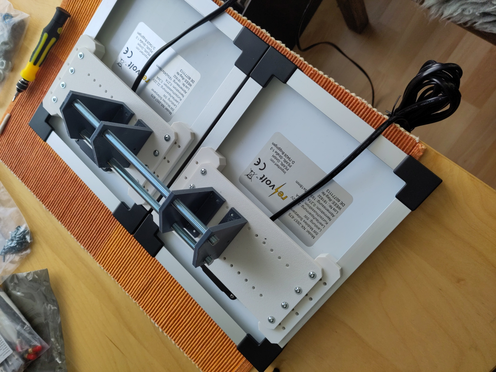
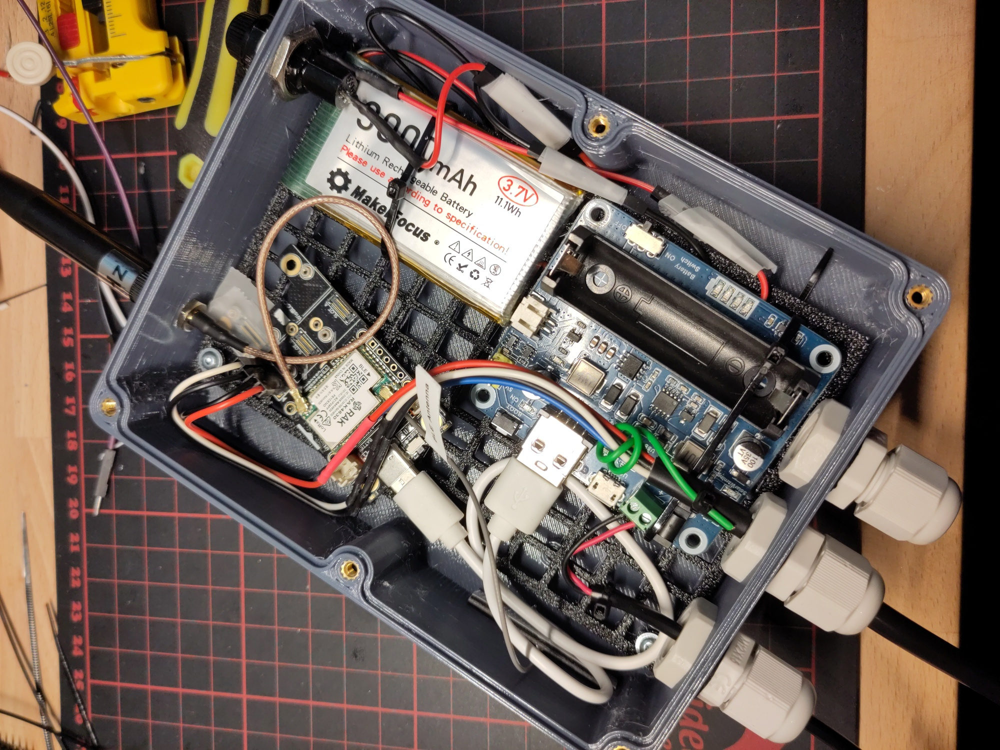
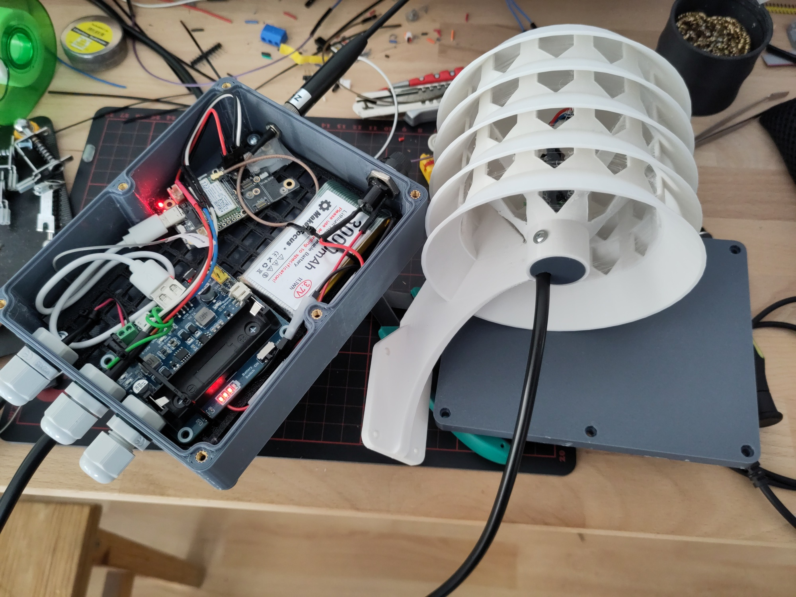
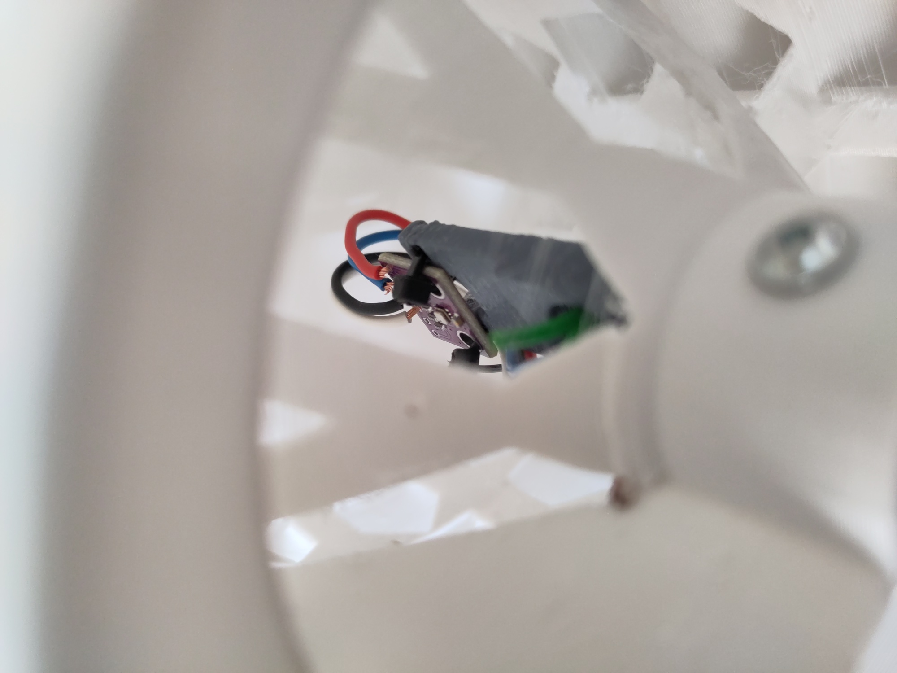
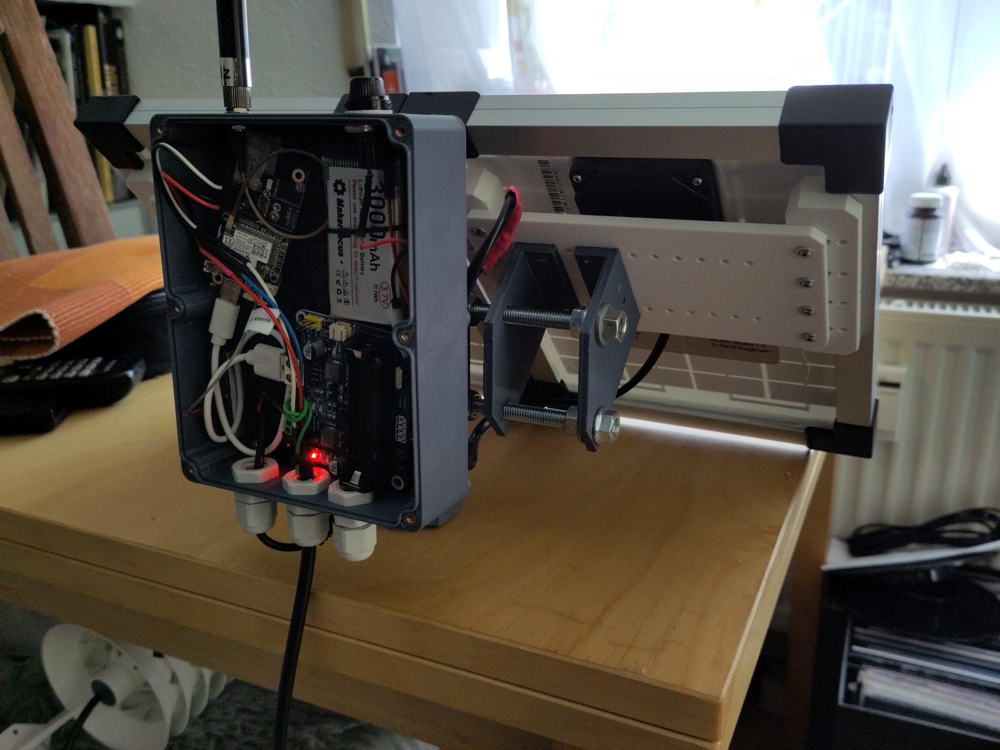
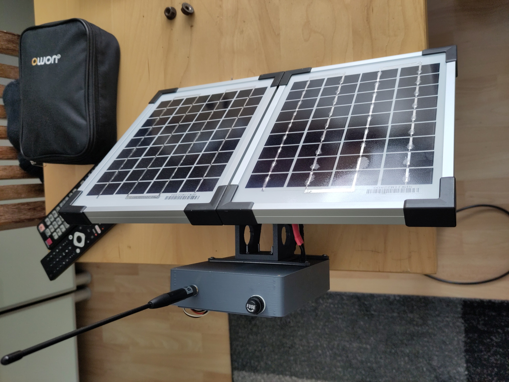
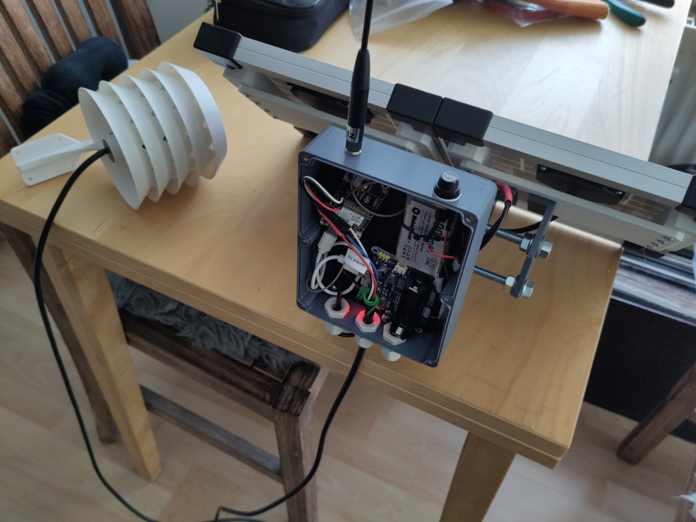
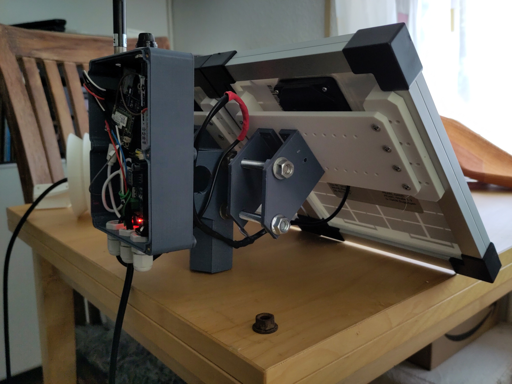
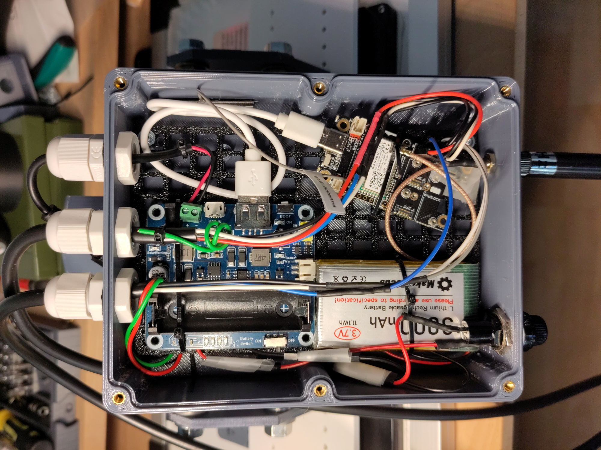

# Meshtastic Info Collection

This Repo stores my Meshtastic related Builds, Measurements, etc.
As I'm searching for Power Consumption of Meshtastic Devices, I also want
to share the measurements of the devices I have and which I used for my builds.


# Power Consumption

```
All Measurements have been done over USB Connection @5V with "Qway USB Measurement Device".
All Values are just approximate values for getting an overview of power consumption of different meshtastic devices. This table is not intended to give very precice values.
```

| Device | flashing |  not initialized | BT | Wifi |
|----|----|----|----|----|
| LilyGo Lora32 T3_V1.6.1 | @5.125V 40mA 0.2W | @5.125V 60mA 0.3W | @5.125V 60mA 0.3W | @5.125V 135mA 0.68W |
| Heltec V3 | @5.125V 40mA 0.2W | @5.115V 125mA 0.6W |  |
| Heltec Wireless Stick Lite v3.1 | @5.125V 45mA 0.25W | @5.115V 110mA 0.56W | @5.115V 110mA 0.56W  | |
| SeeedStudio XIAO NRF52840 Kit | - | - | @5.125V 15mA 0.065W | no Wifi |

# Builds

## rak19007 WisBlock Node

- WisBlock rak19007
- BMP280
- Waveshare MPPT A
- 3500mAh Li Ion Battery
- 3D Printed case and holder

Will be used to read out a Victron MPPT 100/20 and forward to my other nodes which will (hopefully) work with Home Assistant to intergrate telemetry of the Victron into HA.

||||
|----|----|----|
||||
||||


# Hints
## RAK4630 with RUI (Convert RAK4631-R to RAK4631)
I bought some cheaper (and older?) RAK4630 with RAK19003 Base Boards. But I had some trouble flashing Meshcore or https://github.com/oltaco/Adafruit_nRF52_Bootloader_OTAFIX .
I found out that there was a RUI Bootloader `RUI_4.0.6_RAK4631` installed. But an Arduino Bootloader is necessary. Connected to a terminal `(minicom -D /dev/ttyACM1 -b 115200)` gave no output. I found some commands for RUI which printed out some version strings.
One command `AT+BOOT` got into DFU Mode (can be checked with dmesg on Linux). But with that, I also could not use adafruit-nrfutil (or nrfutil) to update the RUI Bootloader.

Then I tried the option with bluetooth. 1st connect to the device using the Android-App `nrf Connect` and the bring it to DFU. In the App the device `DFUTARG` was visible. So I could upload the Arduino Bootloader. Detailed description can be found here: https://docs.rakwireless.com/product-categories/wisblock/rak4631-r/dfu/
Note: As mentioned, I could not use nrfutil. I had to go over bluetooth.

I downloaded the `rak4631_factory_bootloader.zip` to by mobile phone and upload it via `nrf Connect` App and `DFUTARG` to the device. It instantly booted into normal DFU mode and was mounted by the System as storage device.

More:
https://forum.rakwireless.com/t/need-some-help-with-new-4630-dev-kit-cant-program-device/8812
https://github.com/oltaco/WisCore_RAK4631_Bootloader


# LICENSE

<a rel="license" href="http://creativecommons.org/licenses/by-sa/4.0/"></a><br />Dieses Werk ist lizenziert unter einer <a rel="license" href="http://creativecommons.org/licenses/by-sa/4.0/">Creative Commons Namensnennung - Weitergabe unter gleichen Bedingungen 4.0 International Lizenz</a>.

<a rel="license" href="http://creativecommons.org/licenses/by-sa/4.0/"></a><br />This work is licensed under a <a rel="license" href="http://creativecommons.org/licenses/by-sa/4.0/">Creative Commons Attribution-ShareAlike 4.0 International License</a>.
